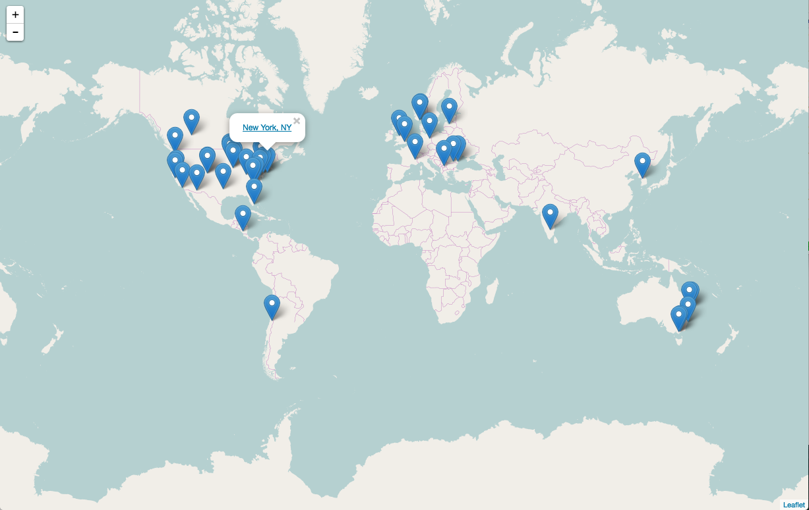
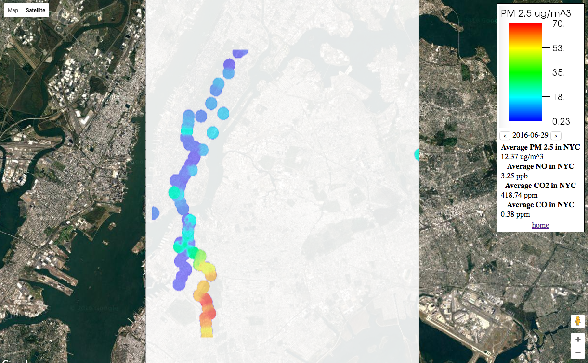

# Purpose
Multiplot is a primarily a visualization tool to interactively display historic pollution levels in major cities around the world.  

# Process
In partnership with Multitude data was collected from air cast, weather underground, Carnegie Mellon, and New York State's department of environmental conservation.  This data was cleaned and processed for outliers, or sensors that were not trustworthy.  
DBSCAN, an unsupervised learning algorithm was used to cluster latitude and longitude coordinates into city centers.  Using geopy, open street maps' python module, the city centers could be mapped and labeled.  VisIt, a visualization software package, was used to create a heatmap of the data in specific cities.  

# Results
This project can be viewed at multiplotviz.com.

There you will land on a beautiful page that looks like this.

  

Each marker is linked to its own map where you can see things like this.
Hope you weren't in Park Slope on June 29th!

  
